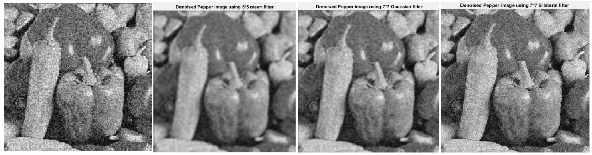
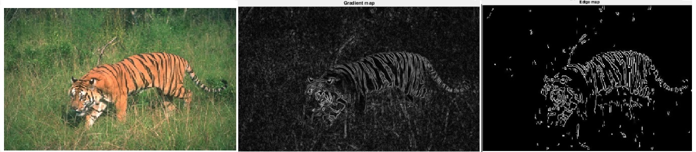
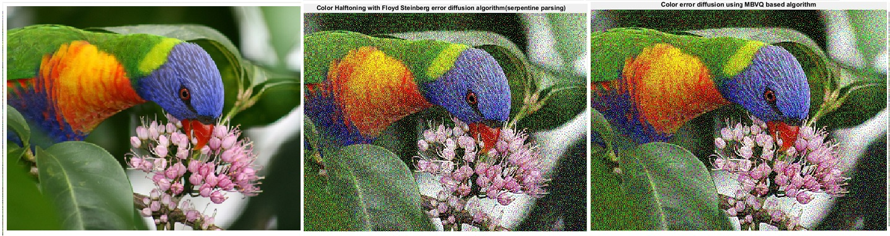

# Image-processing and Computer Vision

## Image Demosaicing 
* The current imaging sensors are not capable of recording the wavelengths of all colors equally at each sensor location. Hence, we use the color filter array (CFA) to capture a particular wavelength at a given sensor. Typically, the CFAs have three distinct types of filters named Red (R), Green (G) and Blue (B) - each of which is most sensitive to a particular range of wavelengths. Thus, image demosaicing is the process of recovering the missing two colors’ information at each sensor location thereby obtaining the R, G, B values at each pixel. The two types of demosaicing techniques used here are:
  * Demosaicing through bilinear interpolation
  * Malvar-He-Cutler (MHC) demosaicing
  
   ### Results
   
   
## Contrast Adjustment through Histogram Equalization techniques
* This is implemented in two ways:
  * The first technique called as transfer function approach, achieves this by conversion of probability density function (PDF) of the input image into a uniform PDF. PDF here refers to the probability of occurrence of each value in the grey-scale. By making each of the pixel values of the input image equally likely we attain the uniform PDF, thereby adjusting the contrast in the image. 
  * The second technique (Method B) is called the cumulative probability based (also called the bucket filling) histogram equalization. In this, we limit the frequency of occurrence of each grey scale value to a number corresponding to the division of the total number of pixels in the image with the possible grey scale range. Starting from the lowest pixel value, if the occurrence of any grey scale value exceeds the previously calculated number, we increment its value by one in those respective pixel locations. This gives rise to a ramp like cumulative distribution function (uniform occurrences of each grey scale value) thereby achieving contrast adjustment. 
  
  ### Results
  
  
## Image Denoising
* Images can generally get corrupted by noise during various stages of processing, starting from its generation to transmission. Thus, denoising becomes a fundamental and a vital step in image processing. The idea behind denoising is to be able to remove noise (high frequency content) as much as possible without destroying the edges (high frequency content). Through denoising, we hope to achieve a better signal to noise ratio which can help us do further processing on the data of interest. Different types of noise can be best tackled by using specific denoising techniques.The figure below shows a sample noisy image and three filters - uniform, gaussian and bilateral used to denoise the same.

  ### Results
  
  
## Edge detection
* Edge detection is an important procedure in image segmentation and processing. It is a technique to find the boundaries within an image. Edges are significant local changes of intensity in an image. The pixels at which there are discontinuities in the brightness can be treated as edge points. The study of edges is rather important because they contain information regarding the shape of an image and can be used for higher level computer vision algorithms (example: object recognition, segmentation). 

  ### Results
  
  
## Digital Halftoning 
* Digital half-toning is an important application in image processing. Printing process with the use of unique ink for almost an infinite range of colors and gray scale values isn’t a viable option and thus, digital half-toning is vital. The idea behind this technique is that the image is converted to discrete dots rather than continuous tones. The dots vary in size or spacing creating a gradient like effect to the human eye. The humans see the halftoned image as a continuous tone because they perceive the density of dots(which is governed by dots per inch (dpi)) rather than the individual dots. By using this method, the amount of unique shades of ink needed reduces drastically and this is why it is very popular in printing newspapers, magazines etc. This method can be extended to color images by repeating the halftone process for each subtractive color i.e., Cyan (C), Magenta (M), Yellow (Y), Black (K) color space.

  ### Results
  
  
 
