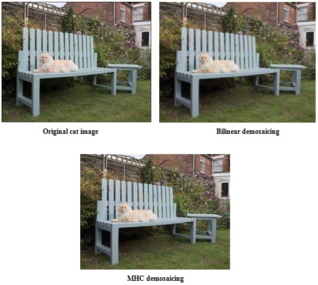

# Image-processing and Computer Vision

## Image Demosaicing 
* The current imaging sensors are not capable of recording the wavelengths of all colors equally at each sensor location. Hence, we use the color filter array (CFA) to capture a particular wavelength at a given sensor. Typically, the CFAs have three distinct types of filters named Red (R), Green (G) and Blue (B) - each of which is most sensitive to a particular range of wavelengths. Thus, image demosaicing is the process of recovering the missing two colors’ information at each sensor location thereby obtaining the R, G, B values at each pixel. The two types of demosaicing techniques used here are:
  * Demosaicing through bilinear interpolation
  * Malvar-He-Cutler (MHC) demosaicing
  
   ### Results
   
   
## Contrast Adjustment through Histogram Equalization techniques
* This is implemented in two ways:
  * The first technique called as transfer function approach, achieves this by conversion of probability density function (PDF) of the input image into a uniform PDF. PDF here refers to the probability of occurrence of each value in the grey-scale. By making each of the pixel values of the input image equally likely we attain the uniform PDF, thereby adjusting the contrast in the image. 
  * The second technique (Method B) is called the cumulative probability based (also called the bucket filling) histogram equalization. In this, we limit the frequency of occurrence of each grey scale value to a number corresponding to the division of the total number of pixels in the image with the possible grey scale range. Starting from the lowest pixel value, if the occurrence of any grey scale value exceeds the previously calculated number, we increment its value by one in those respective pixel locations. This gives rise to a ramp like cumulative distribution function (uniform occurrences of each grey scale value) thereby achieving contrast adjustment. 
  
  ### Results
  

  
 
